# 项目环境

---


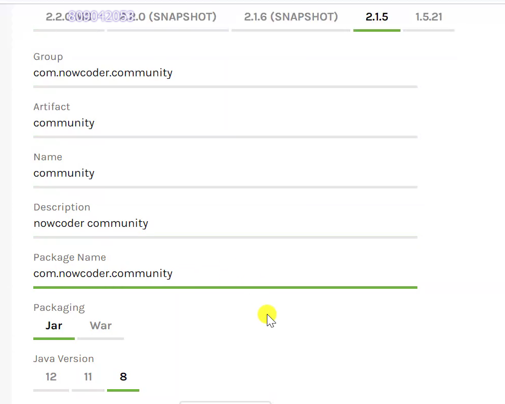


**主要技术**

1. ssm：三层的框架

- spring：管理bean
- springMVC：处理请求
- mybatis：数据库

2. springBoot：开发简易

   整合了spring的内容或者第三方的内容（比如mybatis、光！）

3. 中间件：提高性能

- redis：将服务器查询数据库的结果放入内存中管理
- kafka：消息对列，发布评论之类的
- es：搜索引擎，没错就是类似浏览器的一种索引工具

4. spring的其他技术

- Spring Security: 权限管理，如登入、管理员和普通用户
- Spring Actuato：远程监控，方便维护的，本来应该是维护的活


## 初始pom

```xml
<?xml version="1.0" encoding="UTF-8"?>
<project xmlns="http://maven.apache.org/POM/4.0.0" xmlns:xsi="http://www.w3.org/2001/XMLSchema-instance"
         xsi:schemaLocation="http://maven.apache.org/POM/4.0.0 https://maven.apache.org/xsd/maven-4.0.0.xsd">
    <modelVersion>4.0.0</modelVersion>
    <parent>
        <groupId>org.springframework.boot</groupId>
        <artifactId>spring-boot-starter-parent</artifactId>
        <version>2.1.5.RELEASE</version>
    </parent>

    <groupId>com.nowcoder.community</groupId>
    <artifactId>community</artifactId>
    <version>0.0.1-SNAPSHOT</version>
    <name>community</name>
    <description>nowcoder community</description>

    <properties>
        <java.version>8</java.version>
    </properties>
    <dependencies>
<!--        aop-->
        <dependency>
            <groupId>org.springframework.boot</groupId>
            <artifactId>spring-boot-starter-aop</artifactId>
        </dependency>
<!--        模板-->
        <dependency>
            <groupId>org.springframework.boot</groupId>
            <artifactId>spring-boot-starter-thymeleaf</artifactId>
        </dependency>
<!--        服务器-->
        <dependency>
            <groupId>org.springframework.boot</groupId>
            <artifactId>spring-boot-starter-web</artifactId>
        </dependency>

<!--            springboot的开发者工具，右边会有个小框框-->
        <dependency>
            <groupId>org.springframework.boot</groupId>
            <artifactId>spring-boot-devtools</artifactId>
            <scope>runtime</scope>
            <optional>true</optional>
        </dependency>

        <dependency>
            <groupId>org.springframework.boot</groupId>
            <artifactId>spring-boot-starter-test</artifactId>
            <scope>test</scope>
        </dependency>

<!--        驱动-->
        <dependency>
            <groupId>mysql</groupId>
            <artifactId>mysql-connector-java</artifactId>
            <version>8.0.25</version>
        </dependency>

<!--        mybatis-spring-boot：有mybatis、mybatis-springBoot、jdbc-->
        <dependency>
            <groupId>org.mybatis.spring.boot</groupId>
            <artifactId>mybatis-spring-boot-starter</artifactId>
            <version>2.0.1</version>
        </dependency>

<!--        导连接池的包，虽然springboot确实内嵌了HikariCP的版本，但是这个不导包居然也没事-->
        <dependency>
            <groupId>com.zaxxer</groupId>
            <artifactId>HikariCP</artifactId>
        </dependency>

    </dependencies>

    <build>
        <plugins>
            <plugin>
                <groupId>org.springframework.boot</groupId>
                <artifactId>spring-boot-maven-plugin</artifactId>
            </plugin>
        </plugins>
    </build>

</project>

```


- 需要稍微注意一下编码是utf-8不然会爆炸

```yaml
server:
  port: 80  #端口号
  servlet:
    context-path: /community  #根url


spring:
  # ThymeleafProperties模板
  thymeleaf:
    cache: false
  #数据库连接,这里其实比较任意出错
  datasource:
    driver-class-name: com.mysql.cj.jdbc.Driver
    url: jdbc:mysql://localhost:3306/community?characterEncoding=utf-8&useSSL=false&serverTimezone=Hongkong
    username: root
    password: 123456
    #光！：连接池
    type: com.zaxxer.hikari.HikariDataSource  #数据源的类型，这其实是连接池创建的了
    hikari:
      maximum-pool-size: 15 #连接对象上限# 最大连接数 默认10
      minimum-idle: 5 # 最小空闲连接数量
      idle-timeout: 30000 # 空闲连接存活最大时间 默认600000ms30000毫秒


#mybatis配置
mybatis:
  mapper-locations: classpath:mapper/*.xml  #扫描xml文件，由于xml和dao的接口文件不在同一报下
  type-aliases-package: com.nowcoder.community.entity #扫描实体类，简化包名
  configuration:
    useGeneratedKeys: true  #自动生成主键，大概是返回主键回填
    mapUnderscoreToCamelCase: true #返回值的映射，可以自动my_name转化为myName（底层就是mapResult）

#控制台输出日志的级别，可以看到sql语句（不过是更大的范围）
logging:
    level:
      com:
        nowcoder:
          community: debug
```


# 功能实现

## 分页功能实现

> 开发帖子，使用帖子表显示帖子
>
> - 实现分页查询
>   - sql编写
>   - 数据封装
> - 使用thymheaf模板编写

效果图如下

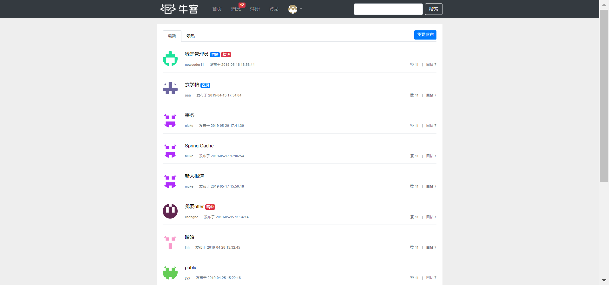


### E-R图部分结构

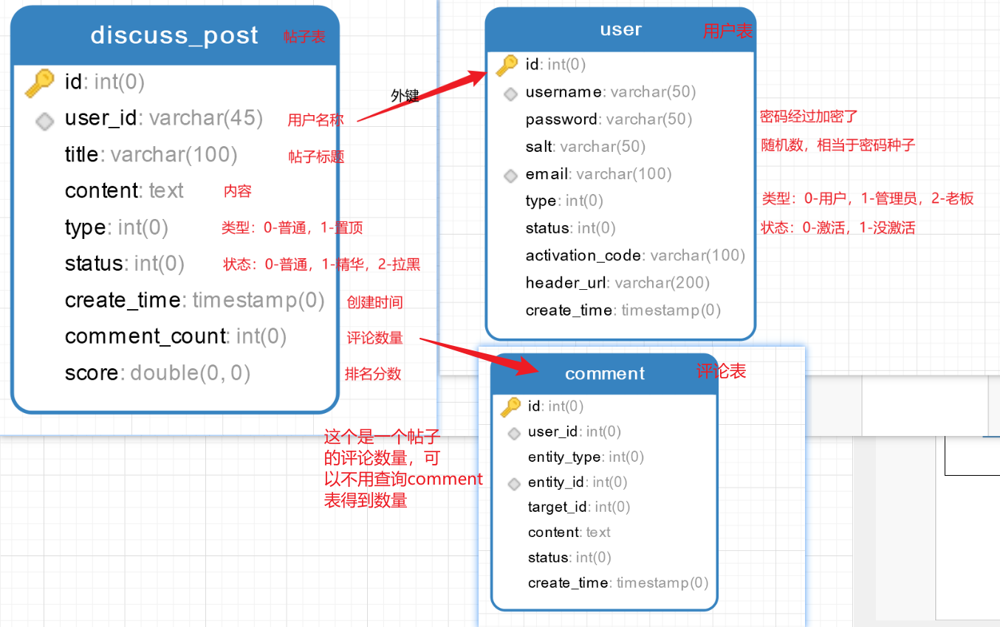


### 实体类

#### 帖子实体

```java
public class DiscussPost {
    private Integer id;
    private Integer userId;
    private String title;
    private String content;
    private Integer type;
    private Integer status;
    //可以使用string接收日期
    //https://blog.csdn.net/ITxiaofeixiang/article/details/117048760
    private Date createTime;
    private Integer commentCount;
    private Double score;
    //set/get/tostring
}
```

> 关于date数据封装和结构化//https://blog.csdn.net/ITxiaofeixiang/article/details/117048760


#### 用户实体

```java
public class User {
    private Integer id;
    private String username;
    private String password;
    private String salt;
    private String email;
    private Integer type;
    private Integer status;
    private String activationCode;
    private String headerUrl;
    private Date createTime;
}
```


#### 页面数据实体

```java
public class Page {
    //请求参数接收
    private int current = 1;  //当前页面
    private int limit = 10;   //一页面的数据量
    //响应参数
    private int rows;   //总数
    private String path;    //查询的url，当然其实rest风格编程不需要担心这个问题

    /**
     * 当前页的起始行,给sql分页查询使用
     *
     * @return
     */
    public int getOffset() {
        // current * limit - limit
        return (current - 1) * limit;
    }

    /**
     * 总页数,给前端显示页码用
     * @return
     */
    public int getTotal() {
        // rows / limit [+1]
        if (rows % limit == 0) {
            return rows / limit;
        } else {
            return rows / limit + 1;
        }
    }

    /**
     * 起始页码,虽然有点不合理，但是没有框架是这样的了，需要编写getFrom，从而模板可以使用page.from得到值
     * @return
     */
    public int getFrom() {
        int from = current - 2;
        return from < 1 ? 1 : from;
    }


    /**
     * 结束页码
     *
     * @return
     */
    public int getTo() {
        int to = current + 2;
        int total = getTotal();
        return to > total ? total : to;
    }

    public int getCurrent() {
        return current;
    }

    public void setCurrent(int current) {
        if (current >= 1) {
            this.current = current;
        } else System.out.println("current太小了");
        return;
    }

    /**
     * 一页的大小，给sql查询用
     *
     * @return
     */
    public int getLimit() {
        return limit;
    }

    public void setLimit(int limit) {
        if (1 <= limit && limit <= 100) {
            this.limit = limit;
        } else System.out.println("limit太小了或者太大了");
        return;
    }

    public int getRows() {
        return rows;
    }

    public void setRows(int rows) {
        if (rows >= 0) {
            this.rows = rows;
        }
    }

    public String getPath() {
        return path;
    }

    public void setPath(String path) {
        this.path = path;
    }
}

```

> 该实体类较为复杂，稍后再说


### dao

#### userMapper:用户表

```java
@Mapper
public interface UserMapper {
    User selectById(Integer id);

    User selectByName(String username);

    User selectByEmail(String email);

    int insertUser(User user);

    int updateStatus(Integer id, Integer status);

    int updateHeader(Integer id, String headerUrl);

    int updatePassword(Integer id, String password);
}
```


#### discussPostMapper：帖子表

```java
@Mapper
public interface DiscussPostMapper {
//    查询所有帖子
    //使用了动态sql，发现没有Param，当个参数居然找不到
    List<DiscussPost> selectAll(@Param("userId") Integer userId);
//    查询一页数据，userId默认为空，支持查询某个用户的帖子
    List<DiscussPost> selectDiscussPosts(@Param("userId") Integer userId, @Param("offset") Integer offset, @Param("limit") Integer limit);
//    查询总的数量，userId默认为空，支持查询某个用户的帖子的
    int selectDiscussPostsRows(@Param("userId") Integer userId);
}
```


> 实现sql语句不在这里说了
>
> discussPostMapper的实现需要考虑
>
> - 是否拉黑
> - `selectDiscussPosts(userId:用户,offset：起始条,limit：限制);` 查询帖子
>   - userId：当为0或者空时表示查询所有人的帖子
>   - userId：有值时表示查询某个用户的帖子
>
> - `selectDiscussPostsRows；` 查询帖子数量，同理
>
> - 排序
>   - 置顶？
>   - 创建时间
>
> - 分页数据来源
>   - 起始条
>   - limit限制
>


service并没有干活：路过


### controller的查询封装做法

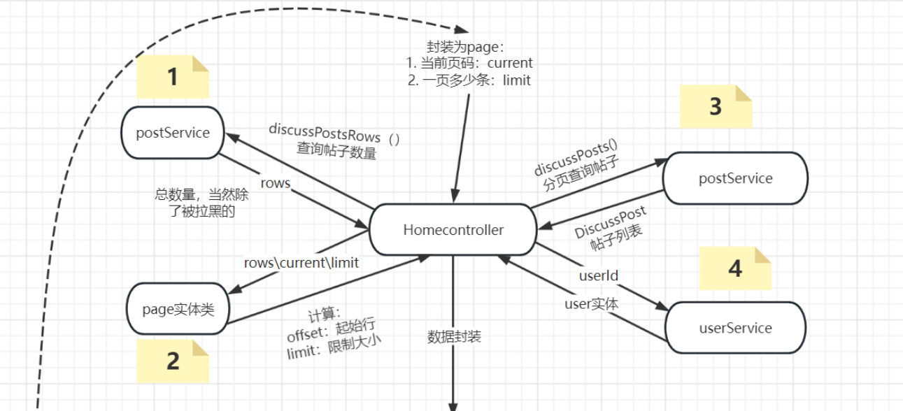

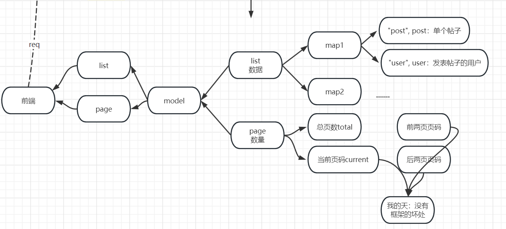


> 多余了什么呢
>
> - 数据封装不在service层
>   - 封装page，应该是 一页的数据+页数 应该在service完成，没有这样做是由于假如封装为了page对象，那么在使用Redis则需要使用序列化的操作对page对象转化，这需要额外的cpu性能，这部分内容详细看redis
> - 前端的需要额外的数据
>   - 前后端不分离的后果


```java
@Controller
public class HomeController {

    @Autowired
    private DiscussPostService postService;

    @Autowired
    private UserService userService;

    @GetMapping("/index")
    public String getIndexPage(Model model,Page page) {

        //总数量
        int rows = postService.discussPostsRows(0);
        page.setRows(rows);
        page.setPath("/index");

        //帖子列表+用户数据
        List<Map<String,Object>> discussPosts = new ArrayList();
        //帖子列表
        List<DiscussPost> postList = postService.discussPosts(0, page.getOffset(),page.getLimit());
        for (DiscussPost post : postList) {
            Integer userId = post.getUserId();  //根据userid找发表帖子的用户
            //用户数据
            User user = userService.selectById(userId);

            Map<String,Object> map = new HashMap();
            map.put("post", post);
            map.put("user", user);

            discussPosts.add(map);
        }

//在开发模板时：假如模板有错误，那么报错很难找到
        model.addAttribute("discussPosts", discussPosts);
        model.addAttribute("page",page);
        return "/index";
    }
```

图示封装为真正的评论表数组

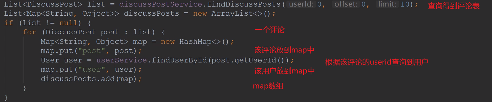


### 模板问题

#### 1、 路径问题

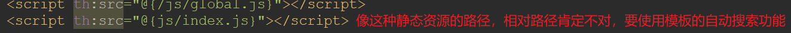

#### 2、 参数接收问题

- `map:discussPosts` :  从数组get元素  `foreach,map=discussPosts.get(0)...`

- `map.user`:        从map get值       `map.get("user")`  
- `map.user.title`: 从对象get值 `(DiscussPost)map.get("post").getTitle` 

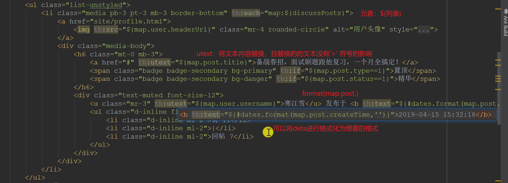

#### 3、 日期问题

‘yyyy-MM-dd HH:mm:ss’


# 调试

## 状态码

> 响应状态码主要分为几种
>
> - 2xx：成功
> - 3xx：重定向
> - 4xx：url找不到对应的controller
> - 5xx：服务器出错
>
> [官网](https://developer.mozilla.org/zh-CN/docs/Web/HTTP/Status/100)
>
> [状态码](D:\workplace\JavaWeb_Video\MyNote\Web核心\BS模型.md#2.4响应数据格式)
>
> [重定向原理详细原理](D:\workplace\JavaWeb_Video\MyNote\Web核心\sevlet_req_and_resp.md#Respones请求重定向)


### 重定向

这里简述一下重定向的原理

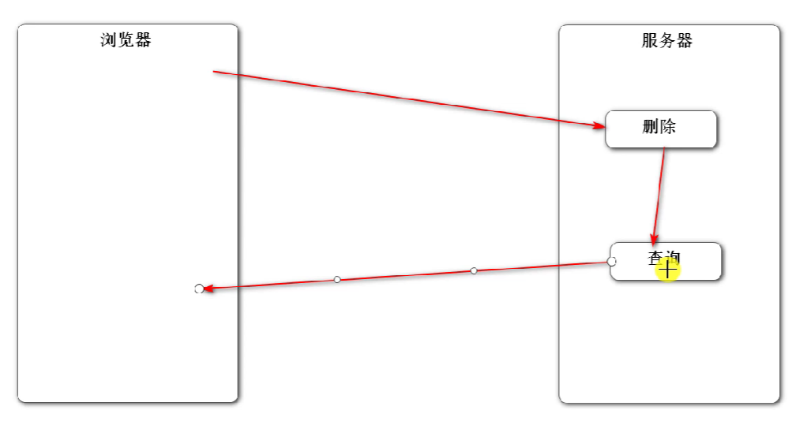

> 程序都是讲究耦合的，删除的contoller去调用查询这是不好的，所以需要客户端重定向导查询


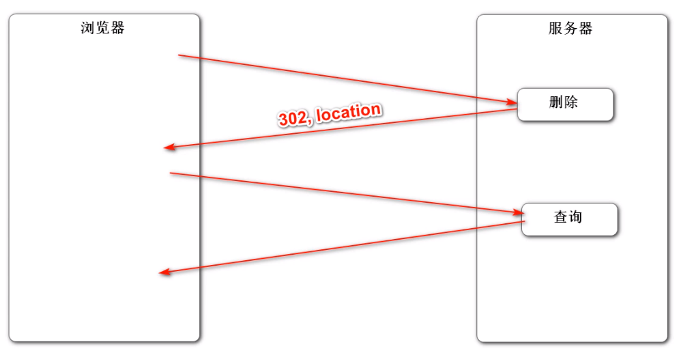


## 断点调试

### 后端

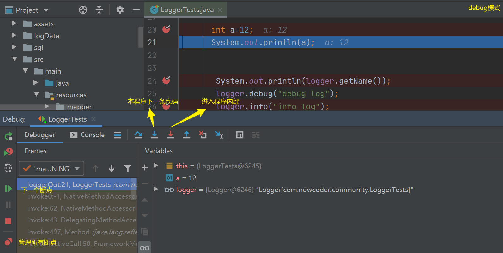


### 前端


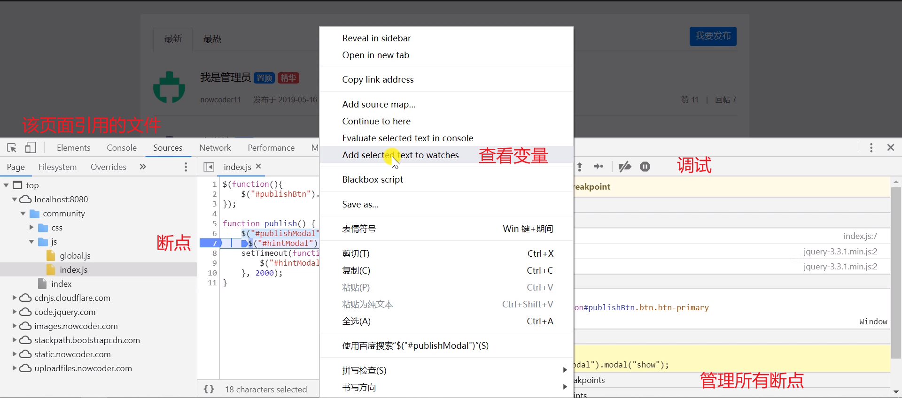


## 日记

### 测试

[官网](https://logback.qos.ch/manual/architecture.html)

> 级别：trace、debug、info、warn、error
>
> 显性的输出日记

```java
//首先声明是使用spring的测试类
@RunWith(SpringRunner.class)
@SpringBootTest
public class LoggerTests {

    //加载需要启动日记的类/包
   private Logger logger = LoggerFactory.getLogger(LoggerTests.class);

   @Test
    public void loggerOut(){
       System.out.println(logger.getName());	//是谁启动了日记
        
       logger.debug("debug log");				//输出对应的级别
       logger.info("info log");
       logger.warn("warn log");
       logger.error("error log");
   }
}
```

当然：会受到配置的影响，假如输出大于debug类型，则效果不同


### yaml配置

> 默认为info级别，默认输出导控制台
>
> 下面的级别，假如大于debug都会输出

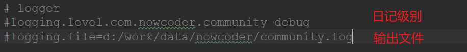


### 配置文件

> 按照不同的级别输出为不同文件
>
> [官网](https://logback.qos.ch/manual/configuration.html)

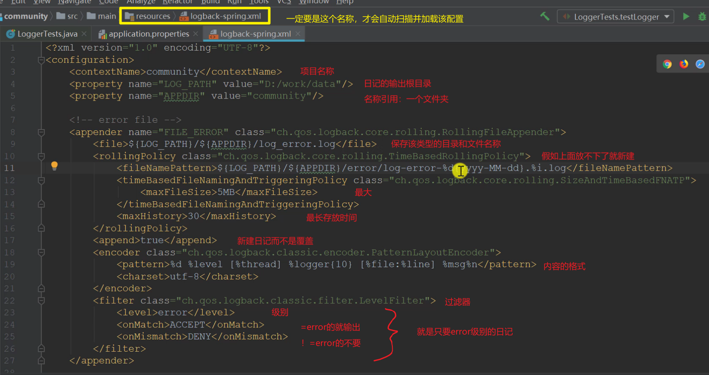

> 优先：配置文件 > yaml


# date

